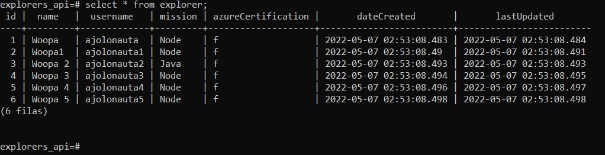

Readme

 1.Como primer paso se agregan las dependencias

```
npm install express --save-dev
npm install prisma --save-dev
```

2. Se Inicializa prisma de la siguiente forma: `npx prisma ini`
3. Se Crea base de datos: `create database explorers_api;`
4. Se modifica el archivo `.env`
5. Se declara una nueva tabla en la DB en el archivo `schema.prisma`
6. Se versiona el nuevo modelo como nuevo cambio en nuestra base de datos, usando el comando: `npx prisma migrate dev --name init`.
7. Se crea un archivo `prisma/seed.js`
8. Se corre el archivo: `node prisma/seed.js`
9. Se verifica que se hayan agregado los explorers en terminal SQL `/select * from explorers;`

   
10. Se crea un Archivo `server.js`

    ```
    const express = require('express');
    const app = express();
    app.use(express.json());
    const port = process.env.PORT || 3000;

    // Require para usar Prisma
    const { PrismaClient } = require('@prisma/client');
    const prisma = new PrismaClient();

    app.get('/', (req, res) => {
      res.json({message: 'alive'});
    });

    app.listen(port, () => {
      console.log(`Listening to requests on port ${port}`);
    });
    ```
11. Se corre el server `node server.js`
12. Agrega un nuevo endpoint GET en tu `server.js` que regrese todos los explorers. Prúebalo en la url: `localhost:3000/explorers`
